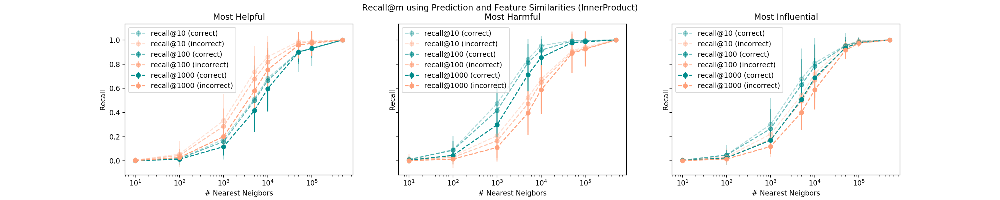

# FastIF with improved search heuristic
This is a work in progress to replicate and improve FastIF search heuristic.
Codes are heavily annotated to simplify understandings.
[Link to the Orginal Paper](https://arxiv.org/abs/2012.15781)

## Improved Recall

# Requirements
Please see `requirements.txt` for detailed dependencies. The major ones include
- `python 3.6 or later` (for type annotations and f-string)
- `pytorch==1.5.1`
- `transformers==3.0.2`
