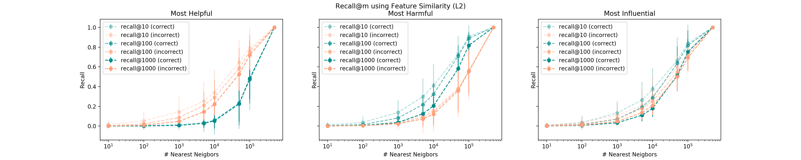

# FastIF with improved search heuristic
This is a work in progress to replicate and improve FastIF search heuristic.
Codes are heavily annotated to facilitate understandings.
[Link to the Original Paper](https://arxiv.org/abs/2012.15781)

## Recall of kNN
**Replication of the original method:**

 
**Improved Heuristic:**

## Explainability of Influential Examples
**Replication of the original method:**
.png)
 
**Improved Heuristic:**
.png)

# Requirements
Please see `requirements.txt` for detailed dependencies. The major ones include
- `python 3.6 or later` (for type annotations and f-string)
- `pytorch==1.5.1`
- `transformers==3.0.2`
